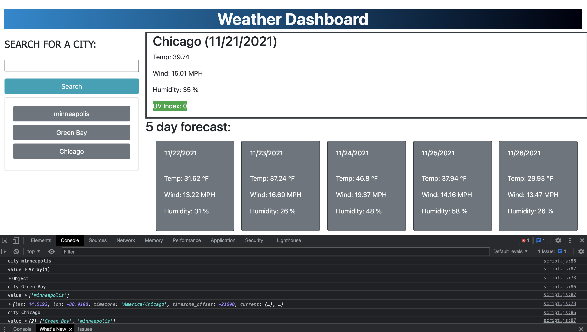

 Weather-Dashboard Starter Code

**Version 1.0.0**

## The Purpose
The purpose of this project was to use third-party API's to import weather data to create a weather forecast. The application would include features such as current weather information, weather information for the next five days, as well as a log of previous search history that is persistent.

## Significant Changes
This project required us to utilize our knowledge of JSON from the module to interpret the data being received from the get weather API call and the one call API. We also built further ontop of old concepts such as: appending script to the dom, local Storage, and event listeners.

### Challenges
The challeneges on this assignment came from trying to figure out a methodology to create persistence to be able to maintain a user's history in the event of a page refresh. Another area that took some forethought was how to get the icons to display properly on the client side. Lastly, I would say the for loop within my one call API took me a few hurdles to get correct- using the power of jquery I love how I am able to directly point at any element in the dom to target it.

#### Screenshot

##### Link
https://nahom-assefa.github.io/weather-dashboard/

###### License and Copyright
© Xander Rapstine, Trilogy Education Services/2U